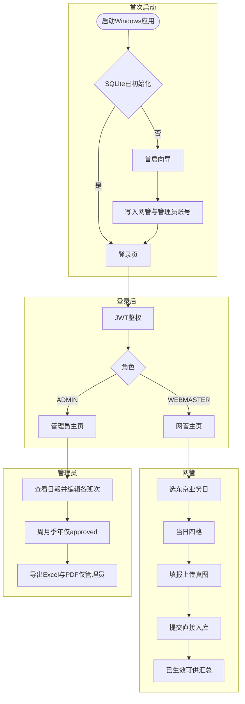
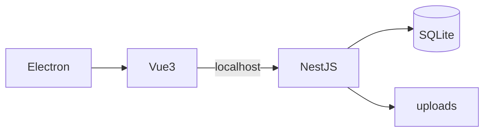

> **项目内副本**：与 `~/.cursor/plans/vue_财务统计全栈_08b5263a.plan.md` 同步；若 Cursor「Plan」面板未刷新，请直接打开本文件。

# Vue + Node 财务统计系统实施计划（含桌面端）

## 时间与首启（已定）

- **时区**：全系统日期边界统一为 **Asia/Tokyo（东京）**。「业务日」= 东京日历日；`reportDate` 存 `YYYY-MM-DD`（东京当日），服务端/前端用同一套换算（如 Luxon / date-fns-tz）。
- **首次运行向导**：安装后首次启动进入**向导**（无有效登录前）：为 **网管**、**管理员** 各设**登录名（可默认）+ 密码**；完成后写入 DB，再进入登录。不设第三个账号。

## 一日四班次与「合成一天日报」

- **业务规则**：每个**东京日历日**内，**早班、白1班、白2班、夜班** 共 **4 次提交机会**；**每个班次对该日只能有一条日報**（未草稿则不可重复提交同班同天）。**网管点击提交即写入数据库并视为最终记录**，**不设**「待管理员确认」环节（无审批队列、无通过/驳回）。
- **数据**：仍为 **DailyReport** 一条记录 = 一个班次的一次填报；库表约束 **`UNIQUE(reportDate, shiftId)`**（`reportDate` 为东京日、`shiftId` 指向班次マスタ）。
- **班次マスタ `Shift`**：种子插入 **4 条**固定业务班次（名称示例：**早班 / 白1班 / 白2班 / 夜班**），`sortOrder` 1～4。管理员**可改显示名**（仍建议保留四条，不随意增删以免破坏「一日四次」）；若改名，历史行依赖 **`shiftNameSnapshot`**。
- **界面（合成一日）**：网管以 **「选日期 → 当日四格」** 呈现：每格对应一班次；已填显示摘要/状态，未填可进入该班次的表单。管理员「全部日報」可按 **日期折叠**，展开为**同一天下四条班次记录**，即**合成一天的日报**视图（数据上仍是四行，汇总报表按行聚合，`byShift` 即此四档）。**管理员在查看某日日报时，可对当日每一班次的一条 `DailyReport` 进入编辑并保存**（与网管同一套表单字段与校验；**可改他人填报的数据**）。

## 日報入力字段与自动计算

### 入力

| 分组 | 字段                              | 说明                                                                                                                                                                     |
| ---- | --------------------------------- | ------------------------------------------------------------------------------------------------------------------------------------------------------------------------ |
| 基本 | 日期 + 班次                       | 由「当日四格」进入时已确定 `reportDate`（东京）与 `shiftId`                                                                                                              |
| 基本 | 责任者                            | `el-select`，管理员维护名单                                                                                                                                              |
| 基本 | 時間帯                            | **精确到分钟**：东京**当日** **00:00～23:59** 内选 **开始 + 结束时刻**（双 **`el-time-picker`**，1 分钟步长）；校验 **起<止**，**结束时刻最大 23:59**（已定案，不使用 `24:00`）；存 **`timeRangeStart` / `timeRangeEnd` + `timeRangeLabelSnapshot`** |
| 売上 | チャージとナイトパック / 商品売上 | 円                                                                                                                                                                       |
| 写真 | DDN写真                           | **真图上传**（见下），非仅勾选                                                                                                                                           |
| 免税 | 三档枚数                          | `TaxFreeCardTier` 可配置面额（默认 1000/5000/10000）                                                                                                                     |
| 写真 | 免税カード写真                    | **真图上传**                                                                                                                                                             |
| 精算 | Newage / Airpay+QR / 現金総額     | 円                                                                                                                                                                       |

### 出力（公式不变）

- **総売上**、**免税カード額（基準×10%）**、**偏差値**（含底钱 **+registerFloatAmount**）、**理由** `deviationReason`；快照字段与既有设计一致。
- **所有业务字段一律必填**（上表所列及写真、精算、売上、免税枚数等，**不允许空保存**）。**底钱 `registerFloatAmount`** 不作为班次表字段，而在**系统设置**里维护为**全局唯一值**（全期共用，管理员在设置页修改）。
- **`deviationReason`（偏差理由）**：仅当**计算出的偏差值为负**（**偏差 < 0**）时**必填**；**非负偏差时可选**（可留空）。

### 税务与用途（范围）

- 日報、汇总与 **Excel/PDF** 以**可提交日本税务机关、税理士审阅**为目标排版；用语与**期间切分**遵循**日本营业与申报常见习惯**。PDF 须**嵌入日文字体**，避免乱码。

### 写真（真图上传与导出对齐）

- **要求**：DDN・免税カード两处均支持 **本地上传图片文件**（jpg/png 等），存于应用 **`userData`/uploads**（或子目录按日/按日報 ID），库中存 **相对路径或 fileId**；限制大小与类型。
- **导出对齐**：Excel 可插**缩略图**或链到附件列；PDF 用模板 **固定图片占位区域**（尺寸/顺序在 **设置** 或导出模板中与管理员预览**对齐**）；打印版式与屏幕「设置」里约定一致（一期可做「图中位置固定 + 自适应缩放」）。

## 登录与角色（两账号）

- **网管**：填报、本人列表；**不可**使用 **Excel / PDF 导出**（无导出菜单与接口权限）；无汇总报表、**无**マスタ设置；**提交即保存**，**无需**管理员确认。
- **管理员**：维护责任者、班次、免税档、底钱（**底钱为全局配置**）；**時間帯**由填报人选起止时刻；**无**「待确认」类工作台（一期不设审批流）；**查看全部日報时，可按日期展开并编辑任意班次的记录**（**PUT** 任意 `dailyReportId`）；**空缺班次允许 `POST` 新建**（与网管相同校验）；周月季年报表；**全部导出能力**（单条日報、周/月/季/年汇总）**均为管理员专属**：**导出 Excel 与导出 PDF**；可看**一日四条**合成视图。**界面不展示**「是否由管理员修改过」**一类提示**（不向用户强调编辑来源）。

## 整体流程图

### 端到端业务主流程

### 技术分层

## 技术选型（补充）

- 上传：`multipart/form-data`，Nest `FileInterceptor`；静态文件由 Nest 或 Electron 暴露只读路径。
- 东京日：所有 `reportDate` 比较、周报自然周切分，均在 **Asia/Tokyo** 下计算。
- **時間帯**：TimePicker **分钟粒度**；**当日有效区间 00:00～23:59**（**已定：结束时刻上限 23:59**）。
- **Excel / PDF 生成（原则：开发省心、运行稳定）**  
  - **Excel（`.xlsx`）**：首选 **[ExcelJS](https://github.com/exceljs/exceljs)**（样式、图片、流式、维护活跃）。备选 **SheetJS（`xlsx`）**：读强、社区版写复杂 xlsx 常有限制 → **本项目以 ExcelJS 为主**。  
  - **PDF**：**(A) HTML/CSS 模板 + 无头浏览器打印**（**Puppeteer** / Playwright）：**版式与日文字体、布局还原最好**，适合税务资料。**缺点**：需带 Chromium，**安装包变大**。(B) **`pdf-lib`**：体积小，但**逐元素排版工作量大**。(C) **PDFKit**：偏底层。**推荐**：导出时由 Nest **按需启动**浏览器，或与**预览用 HTML 同源**再打印；**稳定性优先选 (A)**。  
  - **小结**：固定版式、税务可读性优先 → **ExcelJS + Puppeteer 系**较均衡；若极度在意体积再评估 `pdf-lib`，但开发更重。

## 数据模型（补充）

- **DailyReport**：原字段 + 附件字段；**`timeRangeStart` / `timeRangeEnd`**（分钟精度，**结束 ≤ 当日 23:59**）；**`timeRangeLabelSnapshot`**；**`UNIQUE(reportDate, shiftId)`**；**`createdByUserId`**：**始终指向「原填报网管」**（业务上的填报责任者）；网管本人 **POST** 时即本人；**管理员 POST 补录**时须在界面**指定归属网管**，写入同一字段。**网管提交成功即 `approved`**。**管理员修改后仍为可汇总状态**；内部可保留 **`updatedAt`**；**不向界面暴露**「管理员是否改过」**之标识**（用户不要求）。
- **Shift**：四条种子。
- **无**时间段マスタ表。

## 报表与汇总

- 周/月/季/年：**仅含已提交且可汇总的记录**（与库中 **`approved` 或等价「已生效」状态**一致；网管提交后自动落入该集合）；按东京日期筛选；**byShift** 为四条班次维度。
- 周报「七天」仍为**自然周（周一至周日，东京）**。
- **月 / 季 / 年区间**：按**日本营业与税务资料常见划分**（**自然月**、**自然年（历年）**、**四半期按历年四段**（如 Q1=1～3 月等））；具体标签实现时写死，边界一律按**东京日**。

## API（补充）

- **`GET .../export?format=xlsx|pdf`**（日報单条、周/月/季/年汇总）：**仅 `ADMIN`**；`WEBMASTER` **403**。
- 网管 **POST** 新建 / **PUT** 更新：仅允许 **本人**为 `createdByUserId` 的日報；**直接持久化**为可汇总状态；**一期无** `.../approve`、`.../reject` 等确认类接口。
- **管理员 `POST`**：**允许**在**尚无记录的 (reportDate, shiftId)** 上创建（补录），请求体须含**归属网管**（写入 `createdByUserId`），校验与网管相同。
- **管理员 `PUT /daily-reports/:id`**：**可更新任意**日報行（任意日期、任意班次），与网管相同校验；**不改变「原填报网管」归属**（`createdByUserId` **不因管理员保存而改写为管理员**）。
- 日報保存时服务端校验起止时刻（分钟）；**无** `/meta/time-slots`。
- `POST /daily-reports/:id/photos` 或在创建/更新时 multipart 一并提交。
- `GET` 上传文件需登录且权限（网管仅本人日報附件）。

## 风险与运维

- **不做定期自动备份**（用户明确不需要）；若需防灾，由现场**手动拷贝** `userData` 下 DB 与 uploads。
- 磁盘占用与清理策略（旧图是否随日報删除）。
- PDF：**日文字体嵌入**与图片分辨率（须满足税务提交可读性）。

## 交付物

- Windows 安装包；东京日 + 四班次唯一 + **网管提交无审批** + 真图 + 向导设密 + **导出仅管理员**闭环。
